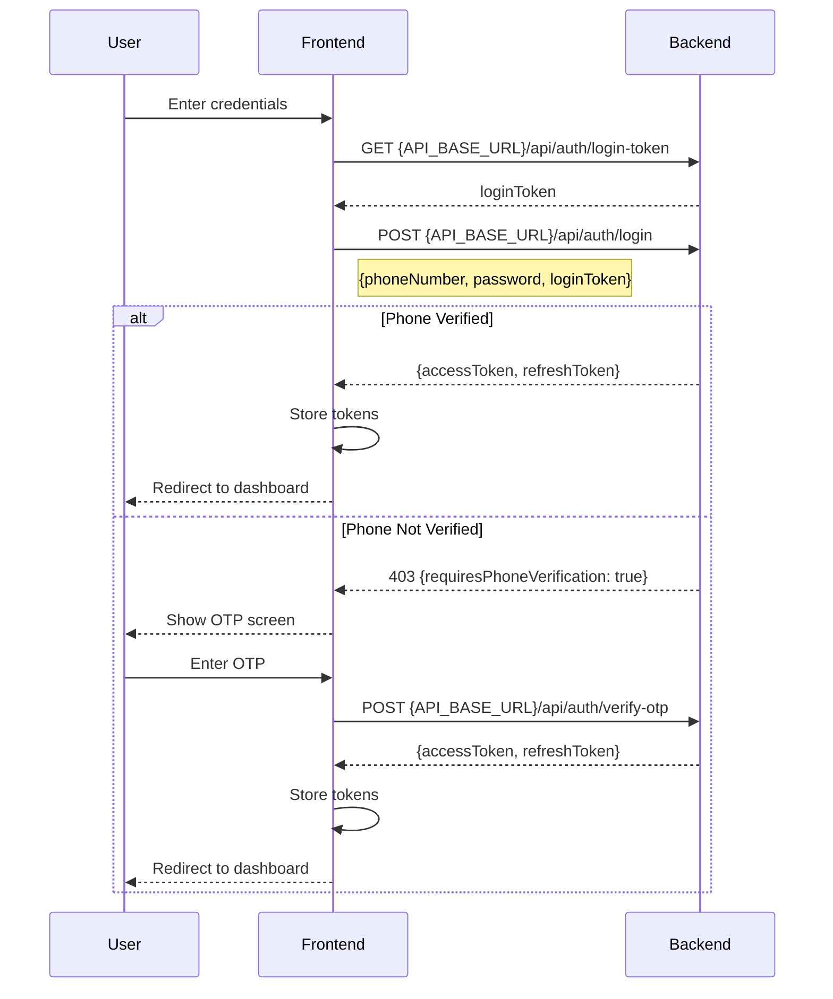
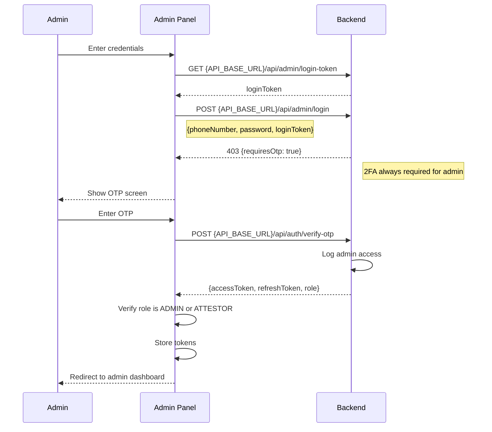
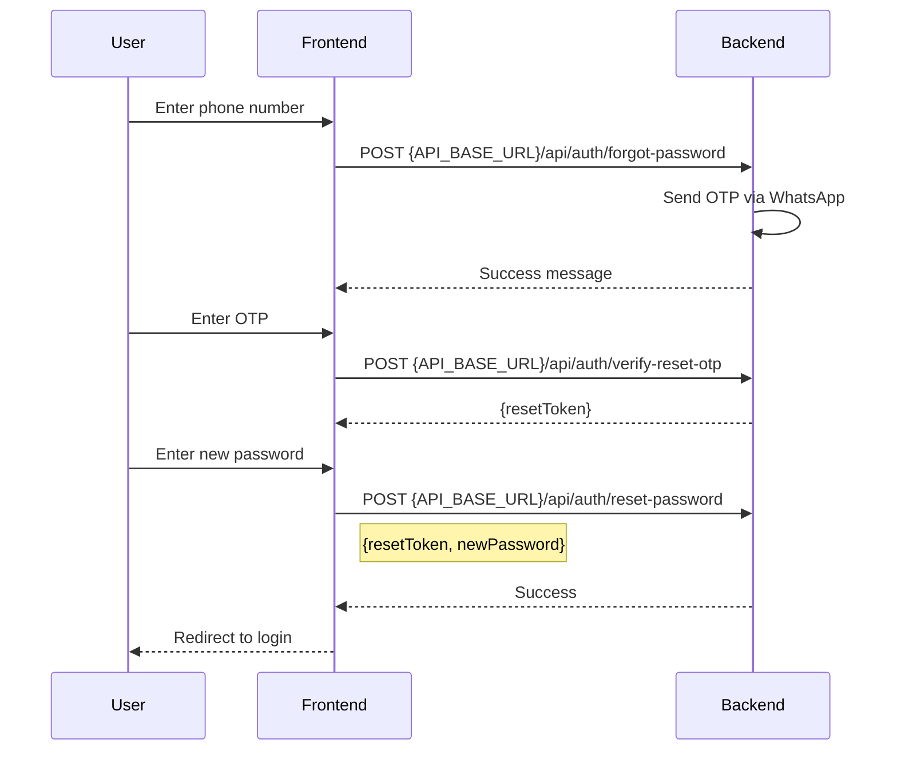

# Authentication Documentation

## Overview

The Kredit platform uses a **custom JWT token-based authentication system** (not NextAuth). Authentication is implemented separately in both the customer frontend (`frontend`) and admin panel (`admin`), with similar patterns but separate token storage mechanisms.

## Base URLs

| Service | Production URL | Description |
|---------|----------------|-------------|
| Backend API | `https://api.andas.com.my` | Main backend API server |
| Frontend App | `https://andas.com.my` | Customer-facing Next.js app |
| Admin Panel | `https://admin.andas.com.my` | Admin Next.js app |
| Signing Service | `https://sign.andas.com.my` | On-prem signing service |

**Development Values:**

| Service | Development URL |
|---------|-----------------|
| Backend API | `http://localhost:4001` |
| Frontend App | `http://localhost:3000` |
| Admin Panel | `http://localhost:3001` |
| Signing Service | `http://localhost:4010` |

---

## Authentication Architecture

### Core Components

1. **Token Storage**: Tokens stored in both `localStorage` and `cookies` for redundancy
2. **Token Refresh**: Automatic refresh mechanism before token expiration
3. **API Proxies**: Next.js API routes act as thin proxies to backend Express API
4. **Route Protection**: Middleware and client-side checks protect authenticated routes
5. **Login Token**: One-time CSRF-like token for enhanced security

---

## Token System

### Token Types

| Token | Lifetime | Storage | Usage |
|-------|----------|---------|-------|
| Access Token | 15 minutes | localStorage + cookies | `Authorization: Bearer <token>` header |
| Refresh Token | 90 days | localStorage + cookies | Obtain new access tokens |
| Login Token | 6 minutes | Server-side (IP-based) | CSRF protection during login |
| Reset Token | 10 minutes | Database | Password reset flow |
| OTP | 5 minutes | Database | Phone verification |

### Token Storage Keys

**Frontend (Customer App)**:
- Access token: `token` (localStorage + cookie)
- Refresh token: `refreshToken` (localStorage + cookie)

**Admin Panel**:
- Access token: `adminToken` (localStorage + cookie)
- Refresh token: `adminRefreshToken` (localStorage + cookie)

---

## Authentication Flows

### Customer Login Flow



### Admin Login Flow



### Password Reset Flow



---

## Frontend (Customer App) Authentication

### Location
`frontend/` directory

### Key Files

| File | Purpose |
|------|---------|
| `frontend/lib/authUtils.ts` | Token storage and utilities |
| `frontend/app/api/auth/login/route.ts` | Login proxy route |
| `frontend/app/api/auth/refresh/route.ts` | Token refresh proxy |
| `frontend/middleware.ts` | Route protection |
| `frontend/components/TokenRefresher.tsx` | Auto-refresh component |

### Token Storage Utility

```typescript
import { TokenStorage } from "@/lib/authUtils";

// Get tokens
TokenStorage.getAccessToken()     // Checks localStorage, then cookies
TokenStorage.getRefreshToken()

// Set tokens
TokenStorage.setAccessToken(token)
TokenStorage.setRefreshToken(token)

// Clear all tokens
TokenStorage.clearTokens()
```

### Making Authenticated Requests

```typescript
import { fetchWithTokenRefresh } from "@/lib/authUtils";

// Automatically handles token refresh on 401/403
const data = await fetchWithTokenRefresh("{API_BASE_URL}/api/users/me");
```

### Route Protection

**Middleware** (`frontend/middleware.ts`):
- Protects all `/dashboard/*` routes
- Checks for `token` or `refreshToken` cookies
- Redirects to `/login` if no tokens found
- Special handling for KYC routes with temporary tokens

**Client-Side**:
```typescript
import { checkAuth } from "@/lib/authUtils";

const isAuthenticated = await checkAuth();
if (!isAuthenticated) {
  router.push("/login");
}
```

---

## Admin Panel Authentication

### Location
`admin/` directory

### Key Files

| File | Purpose |
|------|---------|
| `admin/lib/authUtils.ts` | Admin token storage and utilities |
| `admin/app/api/admin/login/route.ts` | Admin login proxy |
| `admin/app/api/admin/refresh/route.ts` | Admin token refresh proxy |
| `admin/components/TokenRefresher.tsx` | Auto-refresh component |

### Role-Based Access Control

```typescript
// Roles and permissions
const ROLES = {
  ADMIN: "ADMIN",      // Full system access
  ATTESTOR: "ATTESTOR", // Limited admin access
  USER: "USER"         // Customer only (no admin access)
};

// Admin login enforces role check
if (data.role !== "ADMIN" && data.role !== "ATTESTOR") {
  throw new Error("Access denied. Admin or Attestor privileges required.");
}
```

### Making Authenticated Requests

```typescript
import { fetchWithAdminTokenRefresh } from "@/lib/authUtils";

// Always includes Authorization header
// Handles FormData requests appropriately
const data = await fetchWithAdminTokenRefresh("{API_BASE_URL}/api/admin/me");
```

### Authentication Check

```typescript
import { checkAdminAuth } from "@/lib/authUtils";

// Verifies token AND role (ADMIN or ATTESTOR)
const isAuthenticated = await checkAdminAuth();
if (!isAuthenticated) {
  router.push("/login");
}
```

---

## API Endpoints

### Customer Authentication

| Method | Endpoint | Description | Auth |
|--------|----------|-------------|------|
| GET | `{API_BASE_URL}/api/auth/login-token` | Get one-time login token | No |
| POST | `{API_BASE_URL}/api/auth/login` | Login with phone/password | No |
| POST | `{API_BASE_URL}/api/auth/signup` | Register new user | No |
| POST | `{API_BASE_URL}/api/auth/verify-otp` | Verify OTP | No |
| POST | `{API_BASE_URL}/api/auth/resend-otp` | Resend OTP | No |
| POST | `{API_BASE_URL}/api/auth/refresh` | Refresh access token | No |
| POST | `{API_BASE_URL}/api/auth/logout` | Logout user | Yes |
| POST | `{API_BASE_URL}/api/auth/forgot-password` | Request password reset | No |
| POST | `{API_BASE_URL}/api/auth/verify-reset-otp` | Verify reset OTP | No |
| POST | `{API_BASE_URL}/api/auth/reset-password` | Reset password | No |

### Admin Authentication

| Method | Endpoint | Description | Auth |
|--------|----------|-------------|------|
| GET | `{API_BASE_URL}/api/admin/login-token` | Get admin login token | No |
| POST | `{API_BASE_URL}/api/admin/login` | Admin login | No |
| POST | `{API_BASE_URL}/api/admin/refresh` | Refresh admin token | No |
| POST | `{API_BASE_URL}/api/admin/logout` | Admin logout | Yes |
| GET | `{API_BASE_URL}/api/admin/me` | Get admin profile | Yes |

---

## Automatic Token Refresh

### Strategies

| Strategy | Trigger | Location |
|----------|---------|----------|
| Proactive | Token expires within 5 minutes | `TokenRefresher` component |
| On-Demand | API returns 401/403 | `fetchWithTokenRefresh` |
| Visibility | Tab becomes visible | `TokenRefresher` event listener |
| Reconnection | Network comes back online | `TokenRefresher` event listener |

### Refresh Mechanism

```typescript
// Runs every 60 seconds
// Refreshes if token expires within 5 minutes

refreshAccessToken() {
  1. Get refreshToken from storage
  2. POST {API_BASE_URL}/api/auth/refresh with refreshToken
  3. Backend validates and returns new tokens
  4. Store new tokens
  5. Return new accessToken
}
```

---

## Security Features

### Login Token (CSRF Protection)

- One-time use token generated before each login attempt
- Expires after 6 minutes
- IP-address bound (stored server-side keyed by client IP)
- Prevents replay attacks

```typescript
// Step 1: Get token
GET {API_BASE_URL}/api/auth/login-token
Response: { loginToken: "hex_64_chars" }

// Step 2: Include in login
POST {API_BASE_URL}/api/auth/login
Body: { phoneNumber, password, loginToken }
```

### Rate Limiting

| Endpoint | Limit | Window |
|----------|-------|--------|
| Login (User) | 5 attempts | 5 minutes |
| Login (Admin) | 5 attempts | 5 minutes |
| OTP Resend | 1 request | 60 seconds |

Rate limit response:
```json
{
  "message": "Too many login attempts",
  "retryAfter": 300
}
```

### Password Requirements

- Minimum 8 characters
- At least 1 uppercase letter
- At least 1 special character
- No spaces allowed

### Phone Number Format

- E.164 format WITHOUT `+` symbol
- Example: `60123456789` (Malaysia)

### Admin Access Logging

All admin logins are logged with:
- User ID, name, phone, role
- IP address, user agent
- Timestamp

Stored in `admin_access_logs` table.

---

## Cookie Configuration

### Domain Sharing

Cookies support subdomain sharing via `NEXT_PUBLIC_SITE_URL`:

```typescript
// Extracts domain and adds dot prefix
// e.g., ".yourdomain.com" allows sharing across subdomains
```

### Cookie Attributes

- `httpOnly`: false (needs client-side access)
- `secure`: true in production
- `sameSite`: 'lax'
- `path`: '/'
- `domain`: extracted from NEXT_PUBLIC_SITE_URL

---

## Environment Variables

### Frontend/Admin

```env
# Required
NEXT_PUBLIC_API_URL={API_BASE_URL}

# Optional (for cookie domain)
NEXT_PUBLIC_SITE_URL=https://yourdomain.com
```

### Backend

```env
# JWT Configuration
JWT_SECRET=your-jwt-secret
JWT_REFRESH_SECRET=your-refresh-secret
JWT_EXPIRES_IN=15m
JWT_REFRESH_EXPIRES_IN=90d
```

---

## Troubleshooting

### Token Not Refreshing
- Check browser console for refresh errors
- Verify refresh token exists in storage
- Check network tab for refresh API calls

### 401 Errors Despite Valid Token
- Token may have expired; check expiration time
- Verify token is being sent in Authorization header
- Check backend is validating token correctly

### Tokens Lost on Page Refresh
- Ensure cookies are set correctly (domain, path, expiration)
- Verify localStorage is not being cleared
- Check if browser settings block cookies/localStorage

### Rate Limited (429)
- Wait for `retryAfter` seconds
- Check if multiple login attempts were made
- Verify IP detection is working (behind proxy)

---

## Related Documentation

- [CUSTOMER_API_DOCUMENTATION.md](./CUSTOMER_API_DOCUMENTATION.md) - Customer endpoints
- [ADMIN_API_DOCUMENTATION.md](./ADMIN_API_DOCUMENTATION.md) - Admin endpoints
- [API_ENDPOINTS_PENTEST.md](./API_ENDPOINTS_PENTEST.md) - Security testing reference

---

## Key Takeaways

1. **Custom JWT Implementation** - Not NextAuth, full control over token lifecycle
2. **Dual Storage** - localStorage + cookies for redundancy and SSR compatibility
3. **Auto-Refresh** - Multiple strategies ensure tokens stay fresh
4. **Separate Systems** - Frontend and admin use separate token storage
5. **Role-Based** - Admin requires ADMIN/ATTESTOR role verification
6. **2FA for Admin** - All admin logins require OTP verification
7. **CSRF Protection** - Login token prevents replay attacks
8. **Rate Limiting** - Prevents brute force attacks

---

*Last Updated: January 2025*
