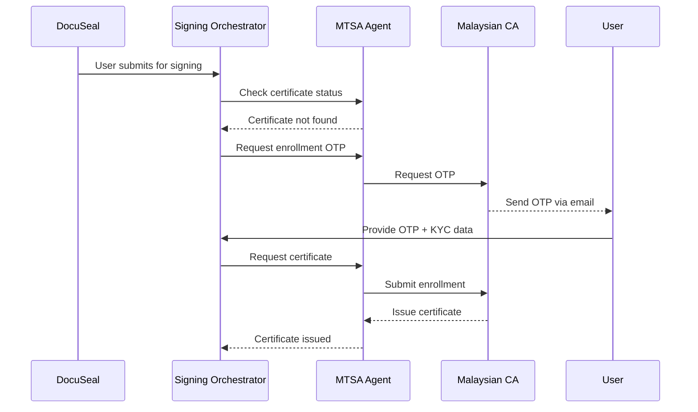
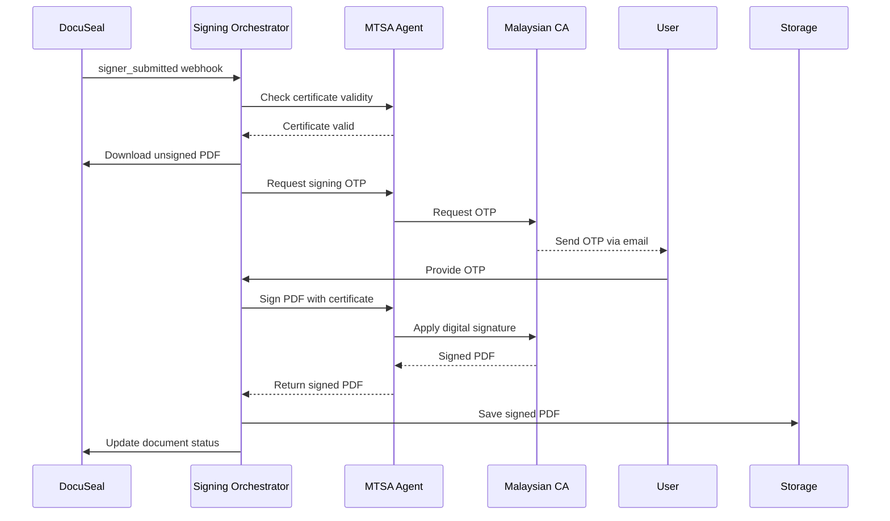

# 🔐 MTSA (MyTrustSigner) Integration Guide

## Overview

This guide covers the integration of MyTrustSigner Agent (MTSA) with the Signing Orchestrator for providing PKI-based digital signatures from the Malaysian Certificate Authority. The integration replaces DocuSeal's default signatures with legally compliant digital certificates.

## Architecture

```
DocuSeal (UI) → Signing Orchestrator → MTSA Agent → Malaysian CA
     ↓                    ↓                ↓            ↓
  Signer UI         API Gateway      PKI Service    Certificates
```

### Components

1. **DocuSeal**: Provides the signing UI and document management
2. **Signing Orchestrator**: Handles webhooks and orchestrates the signing workflow
3. **MTSA Agent**: Interfaces with Malaysian CA for certificate management and signing
4. **Malaysian CA**: Issues and manages digital certificates

## 🚀 Quick Start (Development)

### Prerequisites

- Docker and Docker Compose installed
- MTSA application files in `../../mtsa/` directory
- Valid MTSA pilot credentials

### 1. Configure Environment

```bash
cd /path/to/signing-orchestrator
cp env.development .env

# MTSA credentials are pre-configured for HTTP header authentication:
# MTSA_SOAP_USERNAME=opg_capital_pilot
# MTSA_SOAP_PASSWORD=YcuLxvMMcXWPLRaW
```

> **🔧 Authentication Method**: Uses **HTTP header authentication** (resolved WS111 error)  
> See [MTSA_HTTP_AUTH_GUIDE.md](./MTSA_HTTP_AUTH_GUIDE.md) for technical details

### 2. Deploy Development Environment

```bash
./deploy-mtsa-dev.sh
```

This will:
- Build and start both signing-orchestrator and MTSA containers
- Set up Docker networking between services
- Perform health checks
- Display service status and next steps

### 3. Test the Integration

```bash
./test-mtsa-integration.sh
```

### 4. Access Services

- **Signing Orchestrator**: http://localhost:4010
- **MTSA WSDL**: http://localhost:8080/MTSAPilot/MyTrustSignerAgentWSAPv2?wsdl
- **Health Check**: http://localhost:4010/health

## 🏢 Production Deployment

### Prerequisites

- On-premises server with Docker
- Production MTSA credentials
- SSL certificates configured
- Firewall rules configured

### 1. Configure Production Environment

```bash
sudo cp env.example env.production

# Edit env.production with production settings:
# MTSA_SOAP_USERNAME=your-prod-username
# MTSA_SOAP_PASSWORD=your-prod-password
# DOCUSEAL_WEBHOOK_HMAC_SECRET=your-webhook-secret
```

### 2. Deploy Production Environment

```bash
sudo ./deploy-mtsa-prod.sh
```

This will:
- Create production directories in `/opt/kapital/`
- Set up proper permissions
- Deploy containers with production configuration
- Configure systemd service for auto-restart
- Set up firewall rules

### 3. Verify Production Deployment

```bash
systemctl status mtsa-signing
curl http://localhost:4010/health
curl http://localhost:8080/MTSAPilot/MyTrustSignerAgentWSAPv2?wsdl
```

## 📋 API Endpoints

### Certificate Management

#### Get Certificate Info
```bash
GET /api/cert/:userId
Authorization: Bearer your-api-key
```

#### Request OTP
```bash
POST /api/otp
Content-Type: application/json
Authorization: Bearer your-api-key

{
  "userId": "NRIC_OR_PASSPORT",
  "usage": "DS|NU",
  "emailAddress": "user@example.com"
}
```

#### Enroll User
```bash
POST /api/enroll
Content-Type: application/json
Authorization: Bearer your-api-key

{
  "signerInfo": {
    "userId": "NRIC_OR_PASSPORT",
    "fullName": "User Name",
    "emailAddress": "user@example.com",
    "mobileNo": "60123456789",
    "nationality": "MY",
    "userType": 1
  },
  "verificationData": {
    "status": "verified",
    "datetime": "2025-03-09T10:00:00Z",
    "verifier": "system",
    "method": "ekyc_with_liveness",
    "evidence": {
      "selfieImage": "base64_image_data"
    }
  }
}
```

### Document Signing

#### Manual Signing
```bash
POST /api/sign
Content-Type: application/json
Authorization: Bearer your-api-key

{
  "packetId": "packet-123",
  "documentId": "doc-456",
  "templateId": "template-789",
  "signerInfo": {
    "userId": "NRIC_OR_PASSPORT",
    "fullName": "User Name",
    "emailAddress": "user@example.com",
    "mobileNo": "60123456789",
    "userType": 1
  },
  "pdfUrl": "https://docuseal.example.com/documents/unsigned.pdf",
  "otp": "123456",
  "coordinates": {
    "pageNo": 1,
    "x1": 100,
    "y1": 200,
    "x2": 300,
    "y2": 250
  },
  "fieldUpdates": {
    "CURR_DATE": "2025-03-09",
    "SIGNER_FULLNAME": "User Name"
  }
}
```

#### PDF Verification
```bash
POST /api/verify
Content-Type: multipart/form-data
Authorization: Bearer your-api-key

# Upload PDF file or send as base64
{
  "pdfBase64": "base64_pdf_data"
}
```

## 🔄 Integration Workflow

### 1. Certificate Enrollment Flow



### 2. Document Signing Flow



## 🔧 Configuration

### Environment Variables

| Variable | Description | Default |
|----------|-------------|---------|
| `MTSA_ENV` | Environment (pilot/prod) | `pilot` |
| `MTSA_WSDL_PILOT` | Pilot WSDL URL | `http://mtsa-pilot:8080/MTSAPilot/...` |
| `MTSA_WSDL_PROD` | Production WSDL URL | `http://mtsa-prod:8080/MTSA/...` |
| `MTSA_SOAP_USERNAME` | MTSA authentication username | - |
| `MTSA_SOAP_PASSWORD` | MTSA authentication password | - |
| `SIGNATURE_COORDINATES` | Template coordinate mapping | `{}` |

### Signature Coordinates

Configure signature placement for different templates:

```json
{
  "template-id-1": {
    "pageNo": 1,
    "x1": 100,
    "y1": 200,
    "x2": 300,
    "y2": 250
  }
}
```

## 🔍 Monitoring & Troubleshooting

### Health Checks

```bash
# Overall service health
curl http://localhost:4010/health

# MTSA WSDL availability
curl http://localhost:8080/MTSAPilot/MyTrustSignerAgentWSAPv2?wsdl

# Container status
docker-compose -f docker-compose.mtsa-prod.yml ps
```

### Common Issues

#### 1. MTSA Connection Failed
- Check MTSA container is running
- Verify WSDL URL is accessible
- Check authentication credentials
- Review network connectivity

#### 2. Certificate Enrollment Failed
- Verify OTP is correct and not expired
- Check KYC verification data format
- Ensure user details match ID documents
- Review MTSA logs for specific errors

#### 3. PDF Signing Failed
- Confirm certificate is valid and not expired
- Check PDF format and size
- Verify signature coordinates are valid
- Ensure OTP is provided for signing

### Logs

```bash
# View all logs
docker-compose -f docker-compose.mtsa-prod.yml logs -f

# Specific service logs
docker-compose -f docker-compose.mtsa-prod.yml logs -f signing-orchestrator
docker-compose -f docker-compose.mtsa-prod.yml logs -f mtsa-pilot

# Production logs
tail -f /opt/kapital/logs/signing-orchestrator/app.log
tail -f /opt/kapital/logs/mtsa/catalina.out
```

## 🔐 Security Considerations

1. **Credentials**: Store MTSA credentials securely
2. **Network**: Restrict MTSA access to internal network only
3. **Certificates**: Regularly monitor certificate validity
4. **Logging**: Ensure sensitive data is not logged
5. **Backup**: Regular backup of signed documents and configurations

## 📚 Additional Resources

- [MyTrustSigner API Documentation](./myTrustSigner.md)
- [MTSA Technical Specifications](../../mtsa/OPG-CAPITAL-MyTrustSigner API-TechSpec-ICD-v1.0.pdf)
- [Malaysian Digital Signature Act](https://www.mcmc.gov.my/)

## 🆘 Support

For technical support:
1. Check service logs for specific error messages
2. Verify configuration and credentials
3. Test individual components (MTSA WSDL, API endpoints)
4. Contact MTSA provider for certificate authority issues
