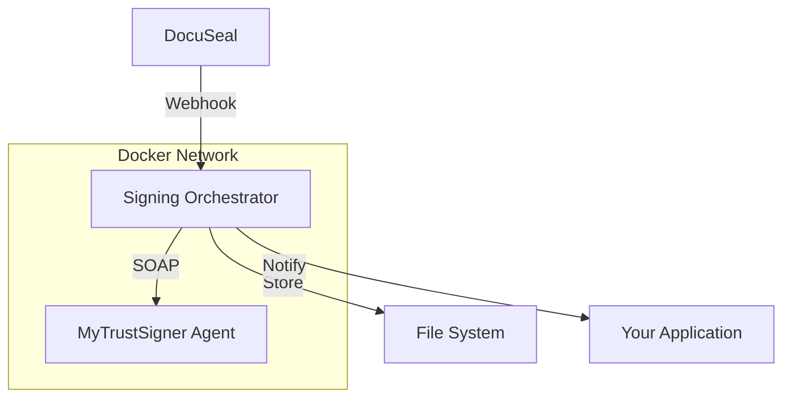

# 🔐 Signing Orchestrator

A comprehensive service that orchestrates digital document signing between **DocuSeal** and **MyTrustSigner Agent** via SOAP API integration.

## 🎯 Overview

The Signing Orchestrator acts as a bridge between:
- **DocuSeal** (self-hosted document signing platform)
- **MyTrustSigner Agent** (PKI/Digital Signing SOAP service)
- **Your application** (via webhooks and REST API)

### Key Features

- ✅ **Webhook Integration**: Receives DocuSeal webhooks for automatic signing workflows
- ✅ **Certificate Management**: Handles user enrollment and certificate lifecycle
- ✅ **Digital Signing**: Coordinates PDF signing with MyTrustSigner Agent
- ✅ **Storage Management**: Secure storage of signed PDFs with organized file naming
- ✅ **Health Monitoring**: Comprehensive health checks and monitoring endpoints
- ✅ **Security**: HMAC webhook verification, rate limiting, and secure logging
- ✅ **Docker Ready**: Full containerization with development and production configurations

## 🏗️ Architecture



## 🚀 Quick Start

### Prerequisites

- Docker and Docker Compose
- DocuSeal instance running
- MyTrustSigner Agent (pilot/production)
- Valid SOAP credentials

### 1. Clone and Setup

```bash
git clone <repository>
cd signing-orchestrator

# Copy environment configuration
cp env.example .env
```

### 2. Configure Environment

Edit `.env` with your settings:

```bash
# Required Settings
DOCUSEAL_WEBHOOK_HMAC_SECRET=your-webhook-secret
DOCUSEAL_API_TOKEN=your-docuseal-api-token
MTSA_SOAP_USERNAME=your-soap-username
MTSA_SOAP_PASSWORD=your-soap-password

# Optional Settings
APP_BASE_URL=https://sign.kredit.my
DOCUSEAL_BASE_URL=https://sign.kredit.my:3001
MTSA_ENV=pilot  # or 'prod'
```

### 3. Start Services

**Development:**
```bash
docker-compose -f docker-compose.dev.yml up -d
```

**Production:**
```bash
docker-compose up -d
```

### 4. Verify Health

```bash
curl http://localhost:4010/health
```

## 📋 API Documentation

### Webhook Endpoints

#### `POST /webhooks/docuseal`
Receives DocuSeal webhooks for automatic signing workflows.

**Headers:**
- `X-DocuSeal-Signature`: HMAC signature for verification

**Events Handled:**
- `signer_submitted`: Triggers signing workflow
- `packet_completed`: Final processing and notifications

### REST API Endpoints

#### `POST /api/sign`
Manual signing trigger

```json
{
  "packetId": "packet-123",
  "documentId": "doc-456",
  "templateId": "template-789",
  "signerInfo": {
    "userId": "IC123456789",
    "fullName": "John Doe",
    "emailAddress": "john@example.com",
    "mobileNo": "60123456789",
    "nationality": "MY",
    "userType": 1
  },
  "pdfUrl": "https://docuseal.example.com/documents/unsigned.pdf",
  "otp": "123456",
  "coordinates": {
    "pageNo": 1,
    "x1": 100,
    "y1": 200,
    "x2": 300,
    "y2": 250
  }
}
```

#### `POST /api/enroll`
Certificate enrollment for new users

```json
{
  "signerInfo": {
    "userId": "IC123456789",
    "fullName": "John Doe",
    "emailAddress": "john@example.com",
    "mobileNo": "60123456789",
    "userType": 1
  },
  "verificationData": {
    "status": "verified",
    "datetime": "2024-01-01T12:00:00Z",
    "verifier": "system",
    "method": "ekyc_with_liveness"
  }
}
```

#### `POST /api/verify`
Verify signed PDF signatures

**Upload file or provide base64:**
```bash
curl -X POST http://localhost:4010/api/verify \
  -H "X-API-Key: your-api-key" \
  -F "pdf=@signed-document.pdf"
```

#### `GET /api/cert/:userId`
Get certificate information for a user

#### `POST /api/otp`
Request OTP for signing or enrollment

```json
{
  "userId": "IC123456789",
  "usage": "DS",  // "DS" for signing, "NU" for enrollment
  "emailAddress": "john@example.com"
}
```

#### `GET /api/signed/:packetId`
List signed PDFs for a packet

### Health Check Endpoints

#### `GET /health`
Basic health check

#### `GET /health/detailed`
Comprehensive health check with component status

#### `GET /health/ready`
Kubernetes readiness probe

#### `GET /health/live`
Kubernetes liveness probe

## 🔧 Configuration

### Environment Variables

| Variable | Required | Default | Description |
|----------|----------|---------|-------------|
| `APP_PORT` | No | `4010` | Application port |
| `APP_BASE_URL` | No | `https://sign.kredit.my` | Base URL for the service |
| `DOCUSEAL_BASE_URL` | No | `https://sign.kredit.my:3001` | DocuSeal instance URL |
| `DOCUSEAL_WEBHOOK_HMAC_SECRET` | **Yes** | - | Webhook HMAC secret |
| `DOCUSEAL_API_TOKEN` | **Yes** | - | DocuSeal API token |
| `MTSA_SOAP_USERNAME` | **Yes** | - | SOAP username |
| `MTSA_SOAP_PASSWORD` | **Yes** | - | SOAP password |
| `MTSA_ENV` | No | `pilot` | MTSA environment (`pilot`/`prod`) |
| `SIGNED_FILES_DIR` | No | `/data/signed` | Signed PDFs storage directory |
| `LOG_LEVEL` | No | `info` | Logging level |

### Template Coordinates

Configure signature coordinates for templates in `SIGNATURE_COORDINATES`:

```json
{
  "template-id-1": {
    "pageNo": 1,
    "x1": 100,
    "y1": 200,
    "x2": 300,
    "y2": 250
  },
  "template-id-2": {
    "pageNo": 2,
    "x1": 150,
    "y1": 300,
    "x2": 350,
    "y2": 350
  }
}
```

## 🔄 Workflow

### Automatic Signing Workflow

1. **DocuSeal Webhook**: Receives `signer_submitted` event
2. **Certificate Check**: Verifies user has valid certificate
3. **Enrollment** (if needed): Issues new certificate via MTSA
4. **OTP Request**: Sends OTP to user's email
5. **PDF Download**: Retrieves unsigned PDF from DocuSeal
6. **Digital Signing**: Signs PDF via MTSA SOAP API
7. **Storage**: Saves signed PDF to filesystem
8. **Notification**: Optional webhook to your application

### Manual Signing Workflow

1. **API Call**: POST to `/api/sign` with signing request
2. **Same Process**: Follows automatic workflow steps 2-8

## 🐳 Docker Deployment

### Development Setup

```bash
# Start with mock MTSA service
docker-compose -f docker-compose.dev.yml up -d

# View logs
docker-compose -f docker-compose.dev.yml logs -f signing-orchestrator
```

### Production Setup

```bash
# Start production services
docker-compose up -d

# Scale if needed
docker-compose up -d --scale signing-orchestrator=2
```

### Docker Networks

The orchestrator connects to:
- `docuseal-network`: Communication with DocuSeal
- `mtsa-network`: Communication with MyTrustSigner Agent

## 📊 Monitoring

### Health Checks

- **Application**: `GET /health`
- **SOAP Connection**: Verifies MTSA WSDL accessibility
- **Storage**: Tests file system write permissions
- **DocuSeal**: Checks DocuSeal reachability

### Logging

Structured JSON logging with:
- Correlation IDs for request tracking
- Sensitive data sanitization
- Configurable log levels
- File rotation in production

### Metrics

Monitor these key metrics:
- Webhook processing success rate
- Signing workflow completion time
- Certificate enrollment success rate
- Storage usage and file counts

## 🔒 Security

### Authentication

- **Webhooks**: HMAC signature verification
- **API**: API key authentication
- **SOAP**: Basic authentication with credentials

### Data Protection

- Sensitive data sanitization in logs
- Secure storage of signed PDFs
- Rate limiting on all endpoints
- CORS configuration

### Network Security

- Internal Docker networks
- No public exposure of MTSA services
- TLS/SSL support for external communications

## 🛠️ Development

### Local Development

```bash
# Install dependencies
npm install

# Start in development mode
npm run dev

# Run tests
npm test

# Lint code
npm run lint
```

### Mock Services

Development includes mock MTSA service for testing:
- Mock SOAP responses
- Simulated certificate operations
- Health check endpoints

## 📝 Integration Guide

### DocuSeal Webhook Setup

1. In DocuSeal admin, go to **Settings > Webhooks**
2. Add webhook URL: `https://your-domain.com/webhooks/docuseal`
3. Set HMAC secret (same as `DOCUSEAL_WEBHOOK_HMAC_SECRET`)
4. Enable events: `signer_submitted`, `packet_completed`

### MyTrustSigner Agent Setup

1. Deploy MTSA Docker container
2. Configure WSDL endpoints in environment
3. Set up network connectivity
4. Verify SOAP service accessibility

### Template Configuration

1. Create templates in DocuSeal
2. Note template IDs
3. Configure signature coordinates in `SIGNATURE_COORDINATES`
4. Test with sample documents

## 🚨 Troubleshooting

### Common Issues

**SOAP Connection Failed**
```bash
# Check MTSA service status
docker-compose logs mtsa-pilot

# Verify WSDL accessibility
curl http://localhost:8080/MTSAPilot/MyTrustSignerAgentWSAPv2?wsdl
```

**Webhook Signature Verification Failed**
```bash
# Check HMAC secret matches DocuSeal configuration
# Verify webhook payload format
```

**Storage Permission Denied**
```bash
# Check directory permissions
ls -la /data/signed

# Fix permissions
sudo chown -R 1001:1001 /data/signed
```

### Debug Mode

Enable debug logging:
```bash
LOG_LEVEL=debug docker-compose up -d
```

### Health Check Debugging

```bash
# Detailed health check
curl http://localhost:4010/health/detailed

# Check individual components
curl http://localhost:4010/health/ready
curl http://localhost:4010/health/live
```

## 📄 License

MIT License - see LICENSE file for details.

## 🤝 Contributing

1. Fork the repository
2. Create feature branch
3. Make changes with tests
4. Submit pull request

## 📞 Support

For issues and questions:
- Check troubleshooting guide
- Review logs with correlation IDs
- Contact system administrator
